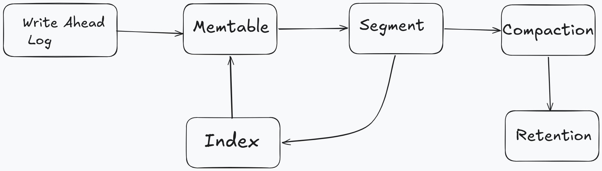
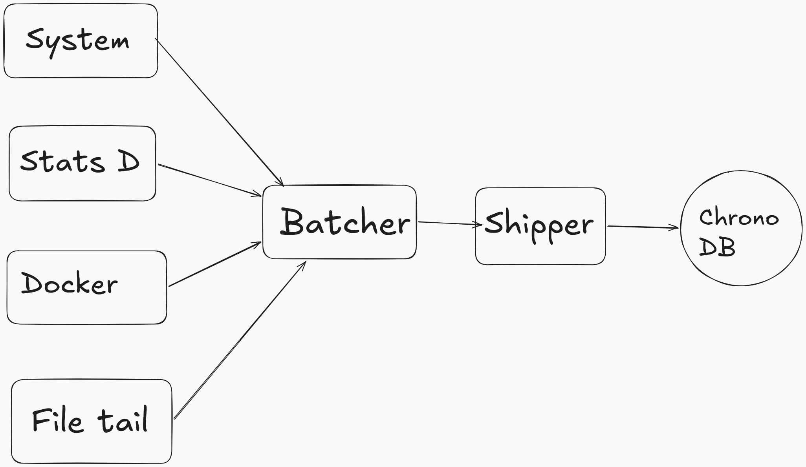

# ChronoDB

Single-threaded time-series database in Go, inspired by the Facebook Gorilla paper.
Comes with **chrono-agent**, a system metrics collector that periodically polls CPU,
memory, disk, and network stats from `/proc` and ships them to ChronoDB.

## Architecture

### Server



- **Engine**: single goroutine event loop processes all commands sequentially
- **WAL**: buffered write-ahead log with CRC32, configurable fsync, crash recovery
- **Memtable**: in-memory write buffer that flushes to segments when full
- **Segment**: immutable binary files with per-series index, v1 (varint-delta) or v2 (Gorilla) encoding
- **Manifest**: JSON metadata tracking segments and WAL offset
- **Index**: in-memory inverted tag index for metric + tag-filter queries
- **Query**: merge, filter, and aggregate across memtable + frozen + segments
- **Compaction**: merge small segments into larger ones
- **Retention**: time-based segment sweep and deletion
- **Gorilla encoding**: delta-of-delta timestamps + XOR float compression

### Agent



- **System collector**: reads `/proc/stat`, `/proc/meminfo`, `/proc/diskstats`, `/proc/net/dev`
- **StatsD listener**: receives UDP StatsD metrics on `:8125`
- **Docker collector**: polls Docker Engine API via Unix socket
- **File tailer**: polls file changes with inode-based rotation detection
- **Batcher**: groups samples by time window and batch size
- **Shipper**: sends to ChronoDB with HTTP retries

## Quick Start

### Server

```bash
make server
./build/chronodb
# or just: make run
```

### Agent

Write a `chrono-agent.yaml`:

```yaml
system:
  interval: "15s"
  enabled_metrics: [cpu, memory, disk, net]
output:
  url: "http://localhost:8080/write"
```

```bash
make agent
./build/chrono-agent
# or just: make run-agent
```

### Collecting metrics without the agent

```bash
# push via HTTP
curl -X POST localhost:8080/write \
  -H 'Content-Type: application/json' \
  -d '{"series":[{"metric":"cpu","tags":{"host":"a"},"points":[{"timestamp":100,"value":0.5}]}]}'

# push via StatsD
echo "myapp.requests:1|c" > /dev/udp/localhost/8125
```

## Querying

```bash
# Raw points (no aggregation)
curl -s -X POST localhost:8080/query \
  -H 'Content-Type: application/json' \
  -d '{"metric":"system.memory.used_percent","start":"2026-06-21T00:00:00Z","end":"2026-06-22T00:00:00Z"}'

# Aggregated with bucket width (returns Sum/Count/Min/Max)
curl -s -X POST localhost:8080/query \
  -H 'Content-Type: application/json' \
  -d '{"metric":"system.memory.used_percent","bucket_width":"30s","aggregation":"avg"}'
```

## API Endpoints

| Method | Path | Description |
|--------|------|-------------|
| POST | `/write` | Write data points |
| POST | `/query` | Query data with optional aggregation |
| GET  | `/metrics` | List all metric names |
| GET  | `/series?metric=X` | List series for a metric |
| GET  | `/engine/metrics` | Engine internal counters |
| GET  | `/healthz` | Liveness probe |
| GET  | `/docs` | API documentation |

## Environment Variables

| Variable | Default | Description |
|----------|---------|-------------|
| `CHRONO_HTTP_ADDR` | `:8080` | HTTP listen address |
| `CHRONO_WAL_PATH` | `data/chronodb.wal` | WAL file path |
| `CHRONO_MANIFEST_PATH` | `data/manifest.json` | Manifest file path |
| `CHRONO_DATA_DIR` | `data` | Data directory for segments |

## Makefile Targets

| Target | Description |
|--------|-------------|
| `all` | Build both binaries |
| `server` | Build chronodb server |
| `agent` | Build chrono-agent |
| `test` | Run tests with race detector |
| `test-short` | Quick test run |
| `vet` | Run go vet |
| `lint` | Run golangci-lint |
| `fmt` | Run go fmt |
| `run` | Start chronodb server |
| `run-agent` | Start chrono-agent |
| `clean` | Remove build artifacts and data |

